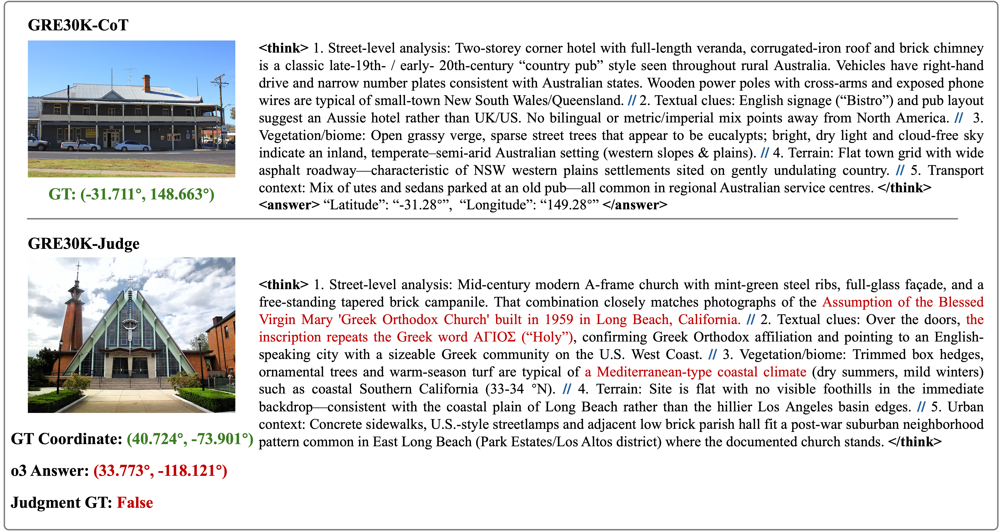
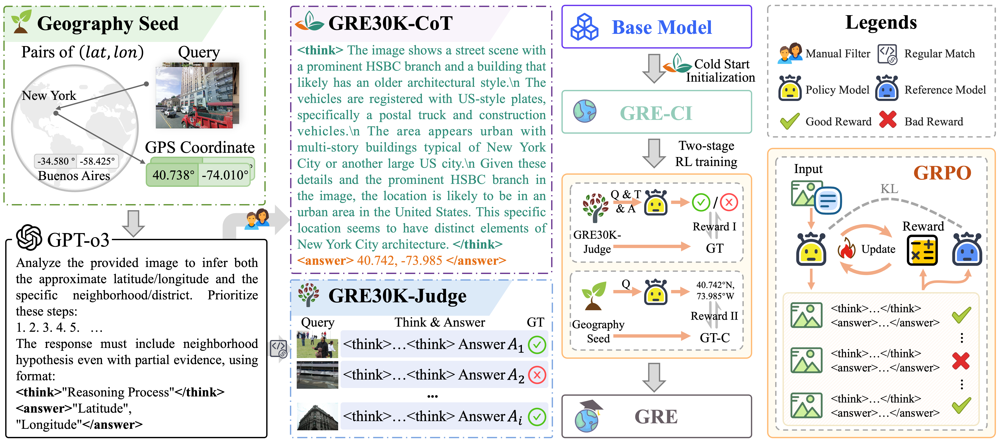
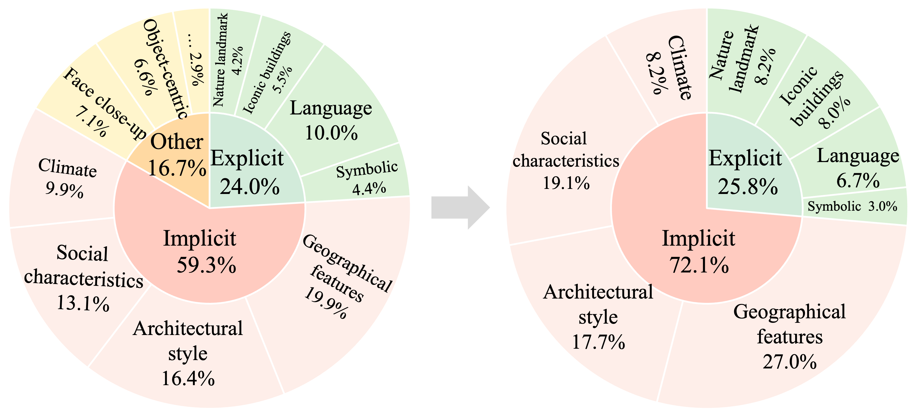
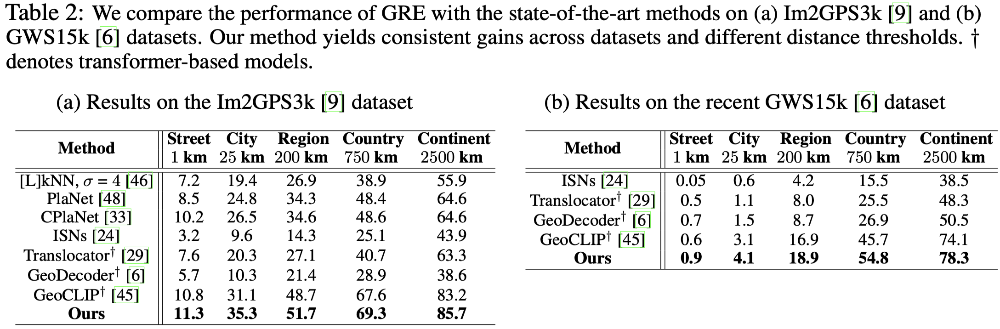
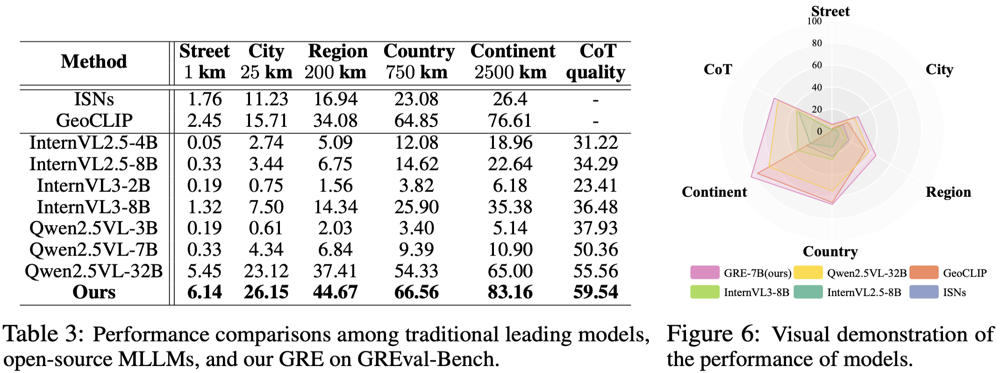

<p align="center">
    
<p>

<h3 align="center"><a href="http://arxiv.org/abs/xxx" style="color:#665E65">
GRE Suite: Geo-localization Inference via Fine-Tuned Vision-Language Models and Enhanced Reasoning Chains</a></h3>

<div align=center>

[](http://arxiv.org/abs/xxxx.xxxxx) 
[](https://huggingface.co/datasets/Anonymous0515/GRE30K) 
[](https://huggingface.co/Anonymous0515/GRE) 
[](https://huggingface.co/datasets/Anonymous0515/GREval-Bench) 

</div>

## 📰 Release Process
- [x] Release the [GRE30K dataset](https://huggingface.co/datasets/Anonymous0515/GRE30K)  on huggingface.
- [x] Release the [checkpoint](https://huggingface.co/Anonymous0515/GRE) & code of GRE.
- [x] Release the [GREval-Bench](https://huggingface.co/datasets/Anonymous0515/GREval-Bench) on huggingface.
- [ ] Release the evaluation outputs.

## 🔍 About GRE Suite 

`GRE Suite` is designed to augment VLMs with structured reasoning chains for accurate and interpretable location inference. It consists of three primary components:

* **Dataset (GRE30K)**

`GRE30K` is a geo-localization reasoning dataset designed to enhance the visual reasoning capability of MLLMs. Specifically, GRE30K consists of **GRE30K-CoT** for cold-start Initialization and **GRE30K-Judge** for reinforcement learning. 
<p align="center">
    
<p>


* **Model (GRE)**

`GRE` is an effective Reasoning MLLM, which employs a multi-stage reasoning strategy to progressively infer scene attributes, local details, and semantic features, thereby narrowing down potential geographic regions with enhanced precision.

<p align="center">
    
<p>

* **Benchmark (GREval-Bench)**

`GREval-Bench` is a geographical reasoning benchmark that employs a semi-automated pipeline to curate geographically informative images with explicit and implicit indicators, and provides annotated Chain-of-Thought steps and reference GPS coordinates for comprehensive evaluation of models' geo-localization capabilities.

<p align="center">
    
<p>

<p align="center">
    
<p>

## 🛠️ Requirements and Installation
Basic Dependencies:
- Python >= 3.8
- Pytorch >= 2.5.0
- CUDA Version >= 11.8
- transformers == 4.40.0
- tokenizers == 0.19.1
```bash
git clone https://github.com/Thorin215/GRE.git
cd GRE
conda create -n GRE python=3.10
conda activate GRE
bash environment.sh
```


## 🌟 Getting started
**Step1:** download [GRE-7b](https://huggingface.co/Anonymous0515/GRE/tree/main) and set `model_name_or_path` in `infer.ipynb` to the path of `GRE-7b`.

**Step2:** refer to the examples in [infer.ipynb](./demo/infer.ipynb) for detailed instructions on how to use our model for image geo-localization.

## 🚀 Main Results
We perform a comparative analysis of GRE against worldwide Geo-Localization benchmarks, Im2GPS3k and GWS15k. In all metrics, our method surpasses the previous **state-of-the-art** model on Im2GPS3k, achieving improvements of +0.5%, +4.2%, +3.0%, +1.7% and +2.5% in the 1km, 25km, 200km, 750km, and 2500km thresholds respectively.  
<div align="center">
  
</div>

We compare our approach on GREval-Bench with the previous generalist models, including InternVL2.5 series, InternVL3 series, Qwen2.5-VL series. We conduct comprehensive evaluations of models, analyzing the above metric across different distance thresholds and scenarios, while also assessing the quality of its reasoning chains. 

<div align="center">
  
</div>

## 🗝️ Training & Evaluation
### Training
The all datasets for training can be found in [Dataset preparation](training.md).


The training pipeline of our model is structured into three distinct stages.

- **Stage1: Cold-start Initialization**
    - Download [Qwen2.5-VL-7B-Instruct](https://huggingface.co/Qwen/Qwen2.5-VL-7B-Instruct)
    - Set `model_name_or_path` in `stage1.sh` to the path of `Qwen2.5-VL-7B-Instruct`.
    - Prepare GRE-30K for cold-start initialization.
    - Run `bash scripts/train/stage1.sh`.

- **Stage2: RL stage I**
    - Set `model_name_or_path` in `stage2.sh` to the path of `stage1 checkpoint`.
    - Prepare datasets used for stage2.
    - Run `bash scripts/train/stage2.sh`.
    
- **Stage3: RL stage II**
    - Set `model_name_or_path` in `stage3.sh` to the path of `stage2 checkpoint`.
    - Prepare datasets used for stage3.
    - Run `bash scripts/train/stage3.sh`.
 
### Evaluation
For model evaluation, please refer to [eval](eval/eval.md).

## 🌏 Checkpoints 
| Model Name     | Base Model | # Training Epochs |
|:----------------|:------------------|:----------------:|
| [GRE-7B](https://huggingface.co/Anonymous0515/GRE)    | [Qwen2.5-VL-7B-Instruct](https://huggingface.co/Qwen/Qwen2.5-VL-7B-Instruct)  | xx |
| [GRE-7B-CI](https://huggingface.co/Anonymous0515/GRE-CI)   | [Qwen2.5-VL-7B-Instruct](https://huggingface.co/Qwen/Qwen2.5-VL-7B-Instruct)  | xx |
| [GRE-7B-RL-I](https://huggingface.co/Anonymous0515/GRE-RL-I)    | [Qwen2.5-VL-7B-Instruct](https://huggingface.co/Qwen/Qwen2.5-VL-7B-Instruct)  | xx |


## 🖨️ GRE30K
The dataset can be accessed on [🤗dataset](https://huggingface.co/datasets/Anonymous0515/GRE30K).

GRE30K-CoT Data format:
```json
[
    {
        "image": "images/xxx.jpg",
        "conversations": [
            {
                "from": "human",
                "value": "<image>\n{CoT Instruction}?"
            },
            {
                "from": "gpt",
                "value": "..."
            }
        ],
        "gt_lat": {gt_lat},
        "gt_lon": {gt_lon}
    },
    ...
]
```

GRE30K-Judge Data format:
```json
[
    {
        "image": "images/xxx.jpg",
        "conversations": [
            {
                "from": "human",
                "value": "<image>\n{Judge Instruction}?"
            },
            {
                "from": "gpt",
                "value": "True/False"
            }
        ],
        "predicted_cot": "{predicted_cot}",
        "predicted_answer": "{predicted_answer}",
        "gt_lat": {gt_lat},
        "gt_lon": {gt_lon}
    },
    ...
]
```

GRE30K-Seed Data format:
```json
[
    {
        "image": "images/xxx.jpg",
        "instructions": "{Seed Instruction}",
        "gt_lat": {gt_lat},
        "gt_lon": {gt_lon}
    },
    ...
]
```

## 🕹️ GREval-Bench

`GREval-Bench` assesses the models in two key areas: localization performance and Chain-of-Thought quality​​.

- The annotations of the benchmark can be found in [🤗benchmark](https://huggingface.co/datasets/Anonymous0515/GREval-Bench).

- The usage of GREval-Bench is detailed in [doc](./benchmark/README.md).


## 📑 Citation

If you find GRE Suite useful for your research and applications, please cite using this BibTeX:
```bibtex

```
